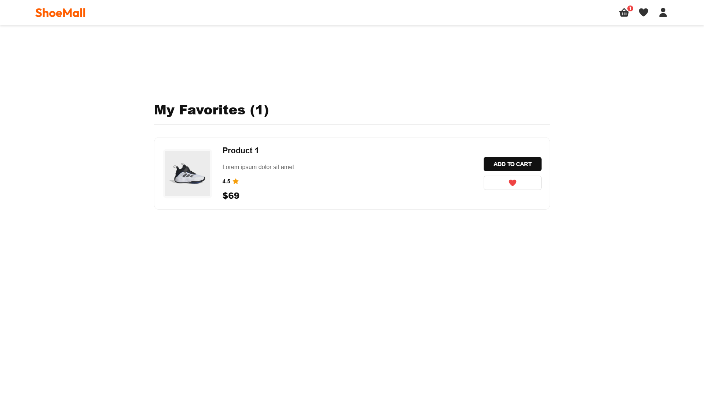

# 👟 ShoeMall | Modern E-Commerce Application

A modern, responsive (mobile-friendly) shoe e-commerce platform developed using React. It features a dynamic structure where users can search for products, view details, add to favorites, and manage their shopping cart.

## WEBSITE PREVIEW
[PREVIEW](https://ysfemre.github.io/ShoeMall-ReactJs/)

## 📸 Screenshots

Below are views of the project on different devices:

### Pages




### Cart Page


## ✨ Features

* **🔍 Real-Time Search:** Instant filtering by product name on the home page.
* **🛒 Dynamic Cart Management:**
  * Adding and removing products from the cart.
  * Size selection requirement and validation.
  * Product count badge on the cart icon.
  * Total price and shipping calculation.
* **❤️ Favorites System:** Adding/removing liked products to/from the favorites list and viewing them on a separate page.
* **📱 Fully Responsive Design:** Seamless look on desktop, tablet, and mobile devices (CSS Grid & Flexbox).
* **📄 Product Detail Page:** Product description, rating, size selection, and similar details.
* **🛣️ Page Routing:** Fast transitions between pages using React Router DOM (Single Page Application).
* **🏷️ Smart Tags:** Automatic "Free Shipping" tag for products over $50.

## 🛠️ Technologies Used

* **React:** Component-based structure and State management.
* **React Router DOM:** Page routing and navigation.
* **CSS3:** Modern Grid and Flexbox structures, animations.
* **FontAwesome:** Icon sets.

## 🚀 Installation and Setup

Follow these steps to run the project locally:

1.  Clone the repository:
    ```bash
    git clone [https://github.com/Ysfemre/ShoeMall-ReactJs.git](https://github.com/Ysfemre/ShoeMall-ReactJs.git)
    ```

2.  Navigate to the project directory:
    ```bash
    cd shoemall
    ```

3.  Install dependencies:
    ```bash
    npm install
    ```

4.  Start the application:
    ```bash
    npm run dev
    ```

---
👨‍💻 **Developer:** Yusuf Emre Çelik
